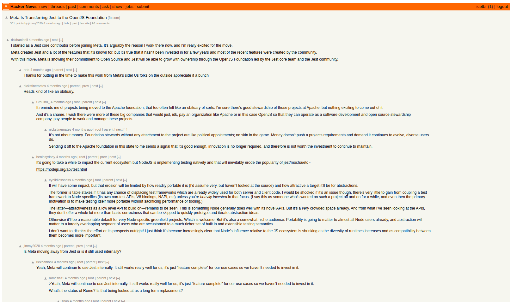
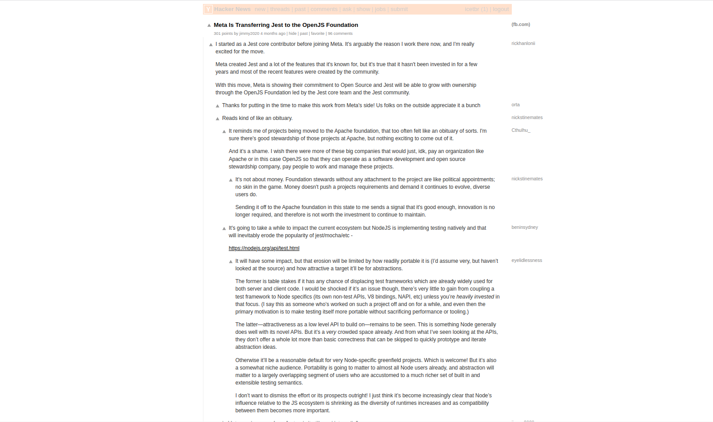

# Hacker News Compact and Clear
Whiter background, narrower, decluttered.

### Before

### After

## Install
[Userscript][1] - [Firefox][2] - [Chrome][3].

## Changes
- **background** is white and narrower
  - I don't know why some people prefer gray
  - adjusted font color to match contrast
- focus on important stuff
  - user name to the right, hiding nav commands and reply date
- reworked comments spacing
- less indentation
  - relying on the vote arrow to differentiate replies
  - vertical guide helps identifying indentation level

### TODO
-  Add pre formatting https://news.ycombinator.com/item?id=19672580

[Contributing](https://github.com/icetbr/my-projects/blob/main/CONTRIBUTING.md)\
[License (MIT)](https://choosealicense.com/licenses/mit/)

[1]: https://openuserjs.org/users/icetbr/scripts
[2]: https://addons.mozilla.org/en-US/firefox/user/36373/
